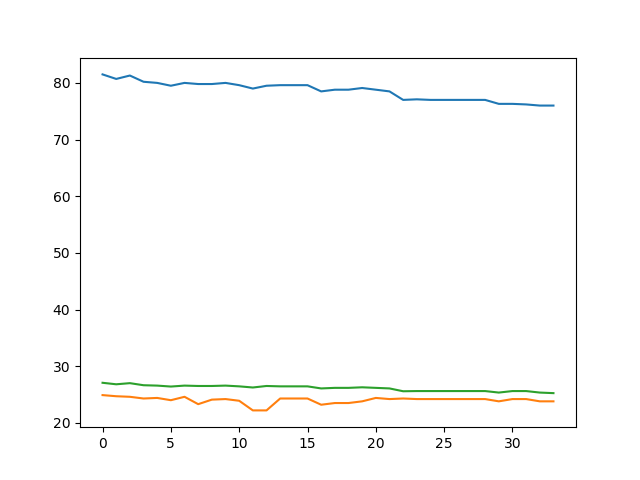

# Open source Diet

事の発端はこのツイートです．


### 締め切りまでにきたRT数が33件でしたので，33日間プロテイン生活となります．

## 内容

- 夕食をプロテインに置き換え，できるだけ間食を挟まないという条件で行う
- プロテイン前には筋トレ
- 時間がある場合，大学のルームランナーで走る
- 昼食なども考える

### 体重の計測などについて
体重の計測にはオムロンのKarada Scan 216 ( [HBF-216](http://kakaku.com/item/K0000506312/) )を使用.高性能に体脂肪もはかれるので有能． 計測時間は夜，シャワーを浴びる前に薄着になるのでその時に計測．

計測した結果はPythonで作成したスクリプトでcsvファイルに書き出す．

最後の方で心がすさんでいそうなので，入力の時，ランダムでかわいいかわいいメイドラゴンの，トールちゃんとカンナちゃんが応援してくれる状態にしました．

```weight.py
#coding:utf-8

import pandas as pd,numpy as np , datetime, random , matplotlib.pyplot as plt
from PIL import Image

# %matplotlib inline

df = pd.read_csv("weightdata.csv",sep=",",index_col=0)

hiduke = datetime.date.today()

print (random.choice(['今日の体重と体脂肪率を入力してください．', '今日の体重を入力してください！はとバスさん！', '体重を入力してぇ，はとバス']))
weight = float(input())
fat = float(input())

day_sum = len(df.index)
minweight = max(df['体重'])
sabun = round(minweight, 5) - weight
sabun = round(sabun,5)
BMI = round(weight/(1.735*1.735),5)
print("体重の差は {0} kg です.BMIは{1}ですよ〜！".format(sabun,BMI))

df2 = pd.Series([day_sum+1,hiduke,weight,sabun,fat,BMI],index=['日数','日付','体重','差分','体脂肪率','BMI'])
df = df.append(df2,ignore_index=True)

df.to_csv('weightdata.csv')

plt.plot(df.体重)
plt.plot(df.体脂肪率)
plt.plot(df.BMI)
plt.savefig("./pic/data.png")

Contact GitHub API Training Shop Blog About

```

やっていることとしてはpandasでcsvを開き，体重と体脂肪率を入力，BMIは身長が変わらないものとし，身長を173.5cmであるとした．

一番体重があった時を元として，どれくらい減量したかなどを表示できるようにもしている．

プロテイン生活が終了してから公開する予定だったが，鬼のように怖い先輩の無言の圧力，また同期にロウソクのロウを垂らされながら脅されたので，公開に至った．

火傷の跡がとても痛い．

# 本日の成果(自動生成)

本日の成果です．



## 最後に

僕はコードレビューをしてもらうためにこれを公開しているわけではないので，致命的な欠陥でない限り他人にとやかく言われる筋合いはない．俺が正義だ．
